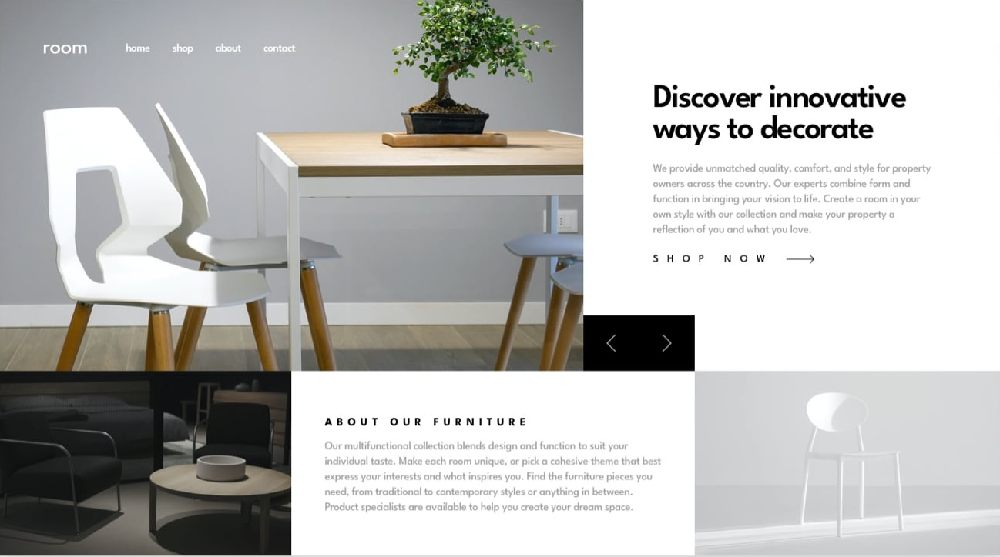

# Room Homepage

A modern, responsive furniture store homepage built with Next.js, React, Tailwind CSS, and TypeScript.  
This project is a solution to the [Frontend Mentor Room Homepage Challenge](https://www.frontendmentor.io/challenges/room-homepage-BtdBY_ENq).

## Overview

This project replicates a stylish furniture homepage with a responsive image slider, navigation menu, and about section. It adapts to all device sizes and demonstrates modern frontend techniques.

## Features

- Responsive layout for desktop and mobile
- Interactive image slider with navigation
- Accessible navigation menu
- Optimized images using Next.js Image component
- Styled with Tailwind CSS

## Built With

- [React](https://reactjs.org/)
- [Next.js](https://nextjs.org/)
- [Tailwind CSS](https://tailwindcss.com/)
- [TypeScript](https://www.typescriptlang.org/)
- Mobile-first workflow

## Screenshots

### Links

- Solution URL: [git repo](https://github.com/agathayin/portfolio/tree/main/src/app/room-homepage)
- Live Site URL: [live site](https://agathayin.net/room-homepage)

## What I Learned

- Deepened understanding of Tailwind CSS utility classes for responsive design.
- Gained experience with Next.js Image optimization and handling different image sources for mobile and desktop.
- Improved skills in managing state for interactive UI components like sliders and navigation menus.

## Continued Development

- Enhance accessibility, especially for keyboard navigation.
- Add animation to slider transitions.
- Explore advanced image optimization techniques.
- Refine responsive layouts for more device sizes.

## Useful Resources

- [Next.js Image Component Documentation](https://nextjs.org/docs/pages/api-reference/components/image)
- [Tailwind CSS Responsive Design](https://tailwindcss.com/docs/responsive-design)
