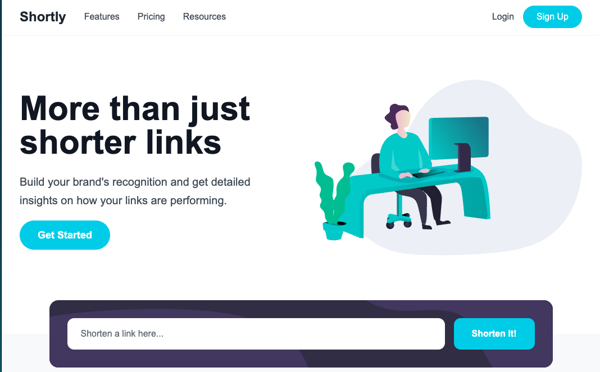

# Frontend Mentor - Shortly URL shortening API Challenge solution

This is a solution to the [Shortly URL shortening API Challenge challenge on Frontend Mentor](https://www.frontendmentor.io/challenges/url-shortening-api-landing-page-2ce3ob-G). Frontend Mentor challenges help you improve your coding skills by building realistic projects.

## Table of contents

- [Frontend Mentor - Shortly URL shortening API Challenge solution](#frontend-mentor---shortly-url-shortening-api-challenge-solution)
  - [Table of contents](#table-of-contents)
  - [Overview](#overview)
    - [The challenge](#the-challenge)
    - [Screenshot](#screenshot)
    - [Links](#links)
  - [My process](#my-process)
    - [Built with](#built-with)
    - [What I learned](#what-i-learned)

## Overview

### The challenge

Users should be able to:

- View the optimal layout for the site depending on their device's screen size
- Shorten any valid URL
- See a list of their shortened links, even after refreshing the browser
- Copy the shortened link to their clipboard in a single click
- Receive an error message when the `form` is submitted if:
  - The `input` field is empty

### Screenshot

### Links

- Solution URL: [git repo](https://github.com/agathayin/portfolio/new/main/src/app/url-shortening)
- Live Site URL: [live site](https://agathayin.net/url-shortening)

## My process

### Built with

- React
- Next
- TypeScript
- TailwindCSS
- Claude Code

### What I learned

To practice my AI prompting skills, I used Claude Code to build this project—and I was genuinely impressed by how powerful and convenient AI can be.

One of the most striking aspects was its responsiveness. I only provided the desktop design and gave no instructions for the mobile layout, yet the AI accurately anticipated how elements should adapt to smaller screens and included all the necessary responsive styles.

It also handled form validation and error messaging remarkably well, even without access to the original design specs. This suggests it was able to understand the nature of the product and identify core features just from the image provided.

There were several pleasant surprises along the way. For example, the AI showed strong familiarity with third-party tools. When building the URL shortening feature, it integrated a real, free API. For the mobile menu, it attempted to use a third-party UI library. And when a large background image was needed but not provided, it created a visually appealing SVG from scratch—showcasing its proficiency with vector graphics.

That said, I did encounter some challenges that required manual review and correction.

The first issue was design accuracy. For instance, the Statistics section was intended to have a staggered, stair-step layout, but the AI initially produced a basic three-column grid. It wasn’t until I gave several rounds of detailed prompts that the output aligned with the intended design. It’s unclear whether this was due to limited visual recognition capabilities or a tendency to default to more common UI patterns.

The second issue was functional correctness. When validating a URL, for example, the AI merged the top two Stack Overflow answers and produced a function that always returned true. Despite rephrasing my prompts multiple times, I kept receiving similarly flawed solutions. Only after providing a clear counterexample did it make meaningful changes—yet even then, it merely added edge case handling without rethinking the logic. This suggests that my prompting still has room for improvement. I suppose a better approach for developers is still to define the logic and structure first, then ask AI for implementation help or suggestions. Ultimately, this reinforces the continued importance of testing, code reviews, and having skilled engineers involved.

Lastly, there was a minor inconvenience: because the AI couldn’t associate images with specific files, I had to manually assign image assets and backgrounds in the early stages. Additionally, the entire output was written in a single file without breaking components apart. However, I believe this could be resolved by upgrading to the Pro version and using it within a more robust development environment like VS Code.
